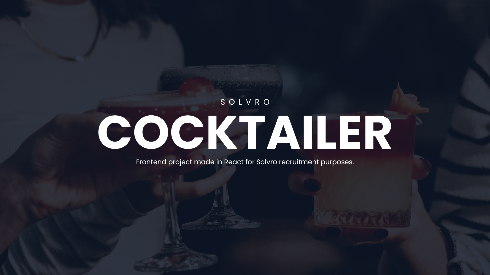

# 🍸 Solvro Cocktailer

**Solvro Cocktailer** is an interactive React application that lets users browse, filter, and save their favorite cocktails fetched from a public API.  
The project was built to explore working with REST APIs, state management, and modern front-end UI design.

> [!NOTE]  
> Public link to page: https://solvro-cocktailer.netlify.app/

---

## ✨ Features

- 🔍 **Search** cocktails by name ❌ (not finished)
- 🧃 **Filter** by alcohol type, category, or glass type
- ❤️ **Add / remove favorites** with animated heart icons
- 🔄 **Toggle view** between all cocktails and favorites
- 📱 Fully responsive design

> [!WARNING]  
> Not all functionalities have been implemented or are partially operational.

> [!IMPORTANT]  
> The function to view the details of the cocktail and its ingredients could not be created in time.

---

## ⚙️ Technologies Used

- **React + TypeScript** – component-based architecture and type safety
- **Axios** – API communication
- **SCSS** – styling and animations
- **Flaticon** – icon set for UI elements

---

## 💡 Key Components

### `App.tsx`
The main entry point of the app.  
Manages global state for favorites and the toggle between *all cocktails* and *favorites* view.  
Stores favorite cocktails in `localStorage`.

### `Header.tsx`
Displays the app title and the ❤️ **Favorites** button, allowing users to switch between views.

### `Filter.tsx`
Interactive filtering panel that allows filtering by:
- cocktail name,
- alcohol type (all / alcoholic / non-alcoholic),
- category,
- glass type.

### `CocktailsList.tsx`
Handles fetching cocktail data from the API, applying filters, and displaying the list of cocktails.  
Also supports the *Favorites* view.

### `Cocktail.tsx`
Represents a single cocktail card — shows image, name, type, and a clickable animated heart icon for favorites.

---

## 🚀 Getting Started

### Install dependencies
`npm install`

### Run in development mode
`npm run start`

### (Optional) Build for production
`npm run build`

The app will be available at: http://localhost:3000/

---

## 🌐 API

The project uses the public Solvro Cocktails API:

https://cocktails.solvro.pl/

---

## 👨‍💻 Author

Frontend design & implementation: **Oliwier Kądziołka / olios**  
GitHub repository: https://github.com/olios123/solvro-cocktailer  
